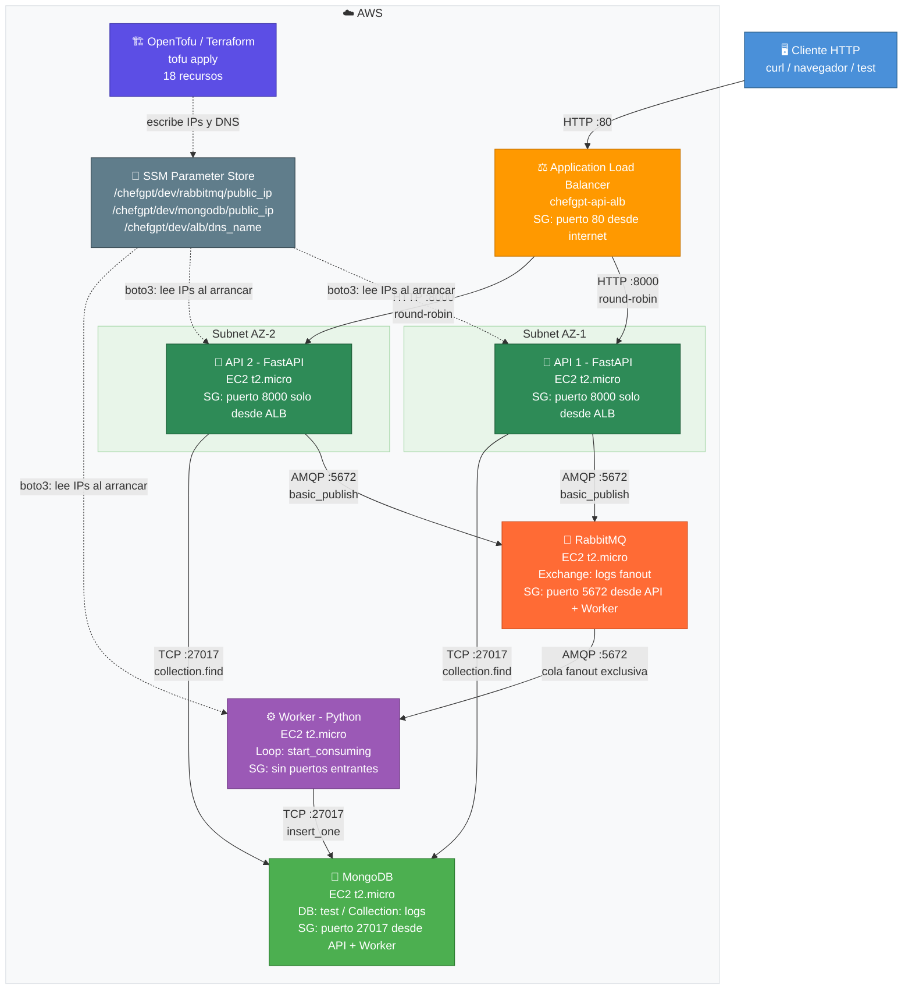
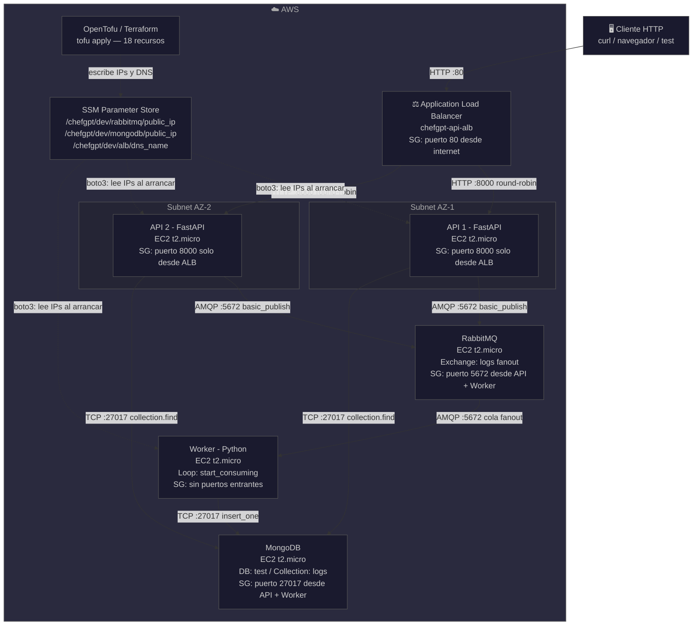

# ChefGPT2 — Sistema de Logging Distribuido en AWS

## Descripción General

ChefGPT2 es un sistema de logging distribuido desplegado completamente en AWS, diseñado como proyecto académico para demostrar una arquitectura de microservicios real. El sistema permite a clientes HTTP enviar mensajes de log a través de una API REST, los cuales viajan de forma asíncrona por un message broker y son persistidos en una base de datos NoSQL. Toda la infraestructura se aprovisiona automáticamente con infraestructura como código mediante OpenTofu.

El proyecto está dividido en dos repositorios separados siguiendo el principio de separación de responsabilidades:

- **ChefGPT2-app**: https://github.com/JACardonaMorales/ChefGPT2-app — código de la aplicación
- **ChefGPT2-infra**: https://github.com/JACardonaMorales/ChefGPT2-infra — infraestructura en AWS

---

## Diagrama de Arquitectura



---



## Flujo del Pipeline Completo

```
1. Cliente ──POST /logs──▶ ALB
2. ALB ──round-robin──▶ API 1 o API 2
3. API ──exchange_declare + basic_publish──▶ RabbitMQ (fanout exchange "logs")
4. RabbitMQ ──deliver──▶ Worker (cola exclusiva enlazada al exchange)
5. Worker ──insert_one()──▶ MongoDB
6. Cliente ──GET /logs──▶ ALB ──▶ API ──collection.find()──▶ MongoDB ──▶ respuesta JSON
```

---

## Componentes del Sistema

### API (`api.py`)

La API es el punto de entrada de la aplicación. Expone tres endpoints REST:

| Método | Ruta | Descripción |
|--------|------|-------------|
| GET | `/` | Health check — confirma que el servicio está activo |
| POST | `/logs` | Recibe un JSON `{"message": "..."}`, lo publica al exchange fanout de RabbitMQ |
| GET | `/logs` | Consulta todos los documentos de la colección `logs` en MongoDB |
| DELETE | `/logs` | Elimina todos los documentos de la colección |

**Decisiones de diseño clave:**

- **Pydantic** valida automáticamente el body del POST — si falta el campo `message` o tiene tipo incorrecto, FastAPI retorna un 422 sin código adicional.
- **SSM Parameter Store** resuelve las IPs al arrancar la instancia mediante `boto3`. Ninguna IP está hardcodeada en el código.
- La conexión a RabbitMQ se abre y cierra por cada POST (`BlockingConnection`) — correcto para el alcance del proyecto; en producción se usaría un pool de conexiones persistentes.
- `exchange_declare` es idempotente — se puede llamar múltiples veces sin error.
- `collection.find({}, {"_id": 0})` excluye el `ObjectId` de MongoDB porque FastAPI no puede serializarlo a JSON directamente.

### Worker (`worker.py`)

El Worker es un proceso Python de larga duración que actúa como consumidor de RabbitMQ y persistidor en MongoDB.

**Comportamiento:**

1. Al arrancar, lee las IPs de RabbitMQ y MongoDB desde SSM Parameter Store.
2. Declara el exchange `logs` de tipo `fanout`.
3. Crea una cola con nombre vacío `''` — RabbitMQ asigna un nombre aleatorio único.
4. La cola es `exclusive=True`: se destruye automáticamente cuando el Worker se desconecta.
5. Enlaza la cola al exchange con `queue_bind`.
6. Entra en `start_consuming()` — loop bloqueante infinito que espera mensajes.
7. Por cada mensaje recibido, ejecuta `callback`: deserializa el body, crea el documento `{"message": ..., "timestamp": ...}` y hace `insert_one()` en MongoDB.

**Por qué `auto_ack=True`:** Para simplificar el código en el contexto académico. En producción se usaría `auto_ack=False` y se haría `ch.basic_ack(delivery_tag=method.delivery_tag)` después de confirmar que el `insert_one()` fue exitoso, garantizando que ningún mensaje se pierda si el Worker falla a mitad de procesamiento.

**Por qué fanout:** Si en el futuro se agrega un segundo Worker (por ejemplo, uno que envíe alertas por email), solo necesita suscribirse al mismo exchange. No hay que modificar la API ni el primer Worker.

### RabbitMQ

RabbitMQ actúa como buffer asíncrono entre la API y el Worker. La API no necesita que MongoDB esté disponible en el momento del POST — si MongoDB cae, los mensajes se acumulan en la cola de RabbitMQ hasta que el Worker pueda procesarlos.

**Exchange fanout:** Distribuye cada mensaje a todas las colas suscritas sin usar routing keys. Es el patrón publish/subscribe más simple.

### MongoDB

Base de datos NoSQL que almacena los logs como documentos JSON en la colección `logs` de la base de datos `test`. Se eligió MongoDB sobre una base de datos relacional porque los logs son documentos semiestructurados sin esquema fijo, y no se requieren transacciones ACID ni relaciones entre entidades.

### Application Load Balancer (ALB)

El ALB es el único punto de entrada al sistema desde internet. Recibe peticiones HTTP en el puerto 80 y las distribuye en round-robin entre las dos instancias de API en el puerto 8000. Realiza health checks automáticos a `GET /` cada 15 segundos — si una instancia falla dos checks consecutivos, el ALB deja de enviarle tráfico.

**Por qué dos instancias de API:** Alta disponibilidad. Si una cae, la otra sigue respondiendo sin interrupción del servicio para el cliente.

### SSM Parameter Store

Centraliza la configuración dinámica. Terraform escribe las IPs de MongoDB y RabbitMQ en SSM después de crear las instancias EC2. La API y el Worker las leen al arrancar mediante `boto3`. Esto elimina el problema de IPs hardcodeadas que cambian cada vez que se reinicia el lab de AWS Academy.

**Parámetros:**

| Nombre | Valor | Escrito por |
|--------|-------|-------------|
| `/chefgpt/dev/rabbitmq/public_ip` | IP pública de la EC2 RabbitMQ | Terraform |
| `/chefgpt/dev/mongodb/public_ip` | IP pública de la EC2 MongoDB | Terraform |
| `/chefgpt/dev/alb/dns_name` | DNS del ALB | Terraform |

---

## Infraestructura como Código (`main.tf`)

El `main.tf` define 18 recursos en orden de dependencia explícita:

```
1. Security Groups (sin dependencias)
        ↓
2. EC2 MongoDB  +  EC2 RabbitMQ  (paralelo)
        ↓
3. SSM Param: mongodb_ip  +  SSM Param: rabbitmq_ip  (paralelo)
        ↓
4. EC2 Worker  +  EC2 API×2  (paralelo, dependen de SSM)
        ↓
5. Target Group  +  Attachments
        ↓
6. ALB  +  Listener
        ↓
7. SSM Param: alb_dns_name
```

Este orden garantiza que cuando el Worker y las APIs arrancan, SSM ya tiene las IPs escritas y los procesos pueden conectarse correctamente.

**Idempotencia:** Si se corre `tofu apply` dos veces, Terraform compara el estado deseado con el estado real y solo aplica diferencias. Si no hay cambios en los `.tf`, no hace nada.

**`depends_on` explícito:** El Worker y las APIs tienen `depends_on = [aws_ssm_parameter.rabbitmq_ip, aws_ssm_parameter.mongodb_ip]` para forzar el orden correcto incluso si Terraform no puede inferir la dependencia implícitamente.

---

## Seguridad — Security Groups

Cada componente tiene su propio security group con el principio de **menor privilegio**:

| Componente | Puerto entrante | Origen permitido |
|------------|----------------|-----------------|
| ALB | 80 | 0.0.0.0/0 (internet) |
| API ×2 | 8000 | Solo SG del ALB |
| RabbitMQ | 5672 | Solo SG de API + Worker |
| MongoDB | 27017 | Solo SG de API + Worker |
| Worker | Ninguno | — (solo conexiones salientes) |

MongoDB y RabbitMQ son completamente inaccesibles desde internet. Aunque alguien conociera su IP pública, el security group bloquea toda conexión que no provenga de los security groups autorizados.

---

## Separación de Repositorios

El proyecto está dividido en dos repos siguiendo el principio de separación de responsabilidades:

**ChefGPT2-app** contiene el código de la aplicación (`api.py`, `worker.py`, `Dockerfile`, `docker-compose.yml`, tests). Es el repo que los scripts de `user_data` clonan en cada EC2 al arrancar.

**ChefGPT2-infra** contiene exclusivamente la infraestructura (`main.tf`, `security_groups.tf`, `variables.tf`, `outputs.tf`, scripts de instalación). Tiene acceso más restringido porque expone la topología completa de la red.

En un pipeline CI/CD real, el repo de app dispararía un pipeline de build/test/deploy automático, mientras que el repo de infra tendría aprobación manual para `tofu apply`.

---

## Comandos de Despliegue

```bash
# Desde ChefGPT2-infra/
tofu init        # Inicializa providers y módulos
tofu plan        # Muestra los 18 recursos a crear
tofu apply       # Despliega la infraestructura (~3-5 minutos)
tofu output      # Muestra DNS del ALB y otras salidas
tofu destroy     # Destruye toda la infraestructura
```

> **Nota AWS Academy:** Las credenciales expiran cada ~4 horas. Si el lab se reinicia, actualiza `~/.aws/credentials` y corre `tofu apply` de nuevo. No es necesario borrar el `tfstate` a menos que el lab haya destruido las instancias.

---

## Endpoints y Pruebas

```bash
ALB_DNS="http://<DNS-del-ALB>"

# 1. Health check
curl $ALB_DNS/

# 2. Enviar un log
curl -X POST $ALB_DNS/logs \
  -H "Content-Type: application/json" \
  -d '{"message": "Log de prueba"}'

# 3. Consultar logs guardados
curl $ALB_DNS/logs

# 4. Limpiar logs
curl -X DELETE $ALB_DNS/logs

# 5. Documentación interactiva
# Abrir en navegador: http://<DNS-del-ALB>/docs
```

---

## Ejecución Local

```bash
# Desde ChefGPT2-app/
docker compose up --build

# API disponible en: http://localhost:8000
# Swagger UI en:     http://localhost:8000/docs
# RabbitMQ UI en:    http://localhost:15672  (user/password)
```

---

## Tecnologías

| Tecnología | Rol en el sistema |
|------------|-------------------|
| FastAPI + Uvicorn | Framework web async, servidor ASGI |
| Pydantic | Validación automática de modelos de datos |
| Pika | Cliente Python para protocolo AMQP (RabbitMQ) |
| PyMongo | Cliente Python para MongoDB |
| Boto3 | SDK de AWS para Python (SSM Parameter Store) |
| RabbitMQ | Message broker, fanout exchange |
| MongoDB | Base de datos NoSQL, almacenamiento de logs |
| AWS EC2 | Cómputo en la nube (5 instancias t2.micro) |
| AWS ALB | Balanceo de carga, punto de entrada único |
| AWS SSM | Gestión centralizada de configuración dinámica |
| OpenTofu / Terraform | Infraestructura como código |
| Docker / Docker Compose | Contenedores para desarrollo local |
