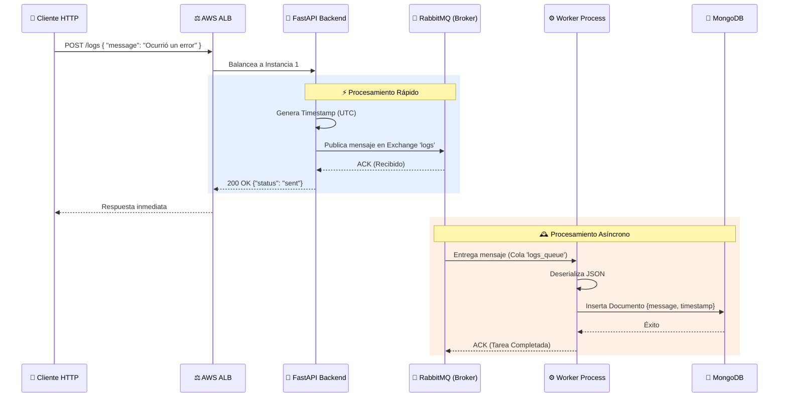

# 📖 ChefGPT2 — Sistema de Logging Distribuido (Production-Ready)

**ChefGPT2** es un sistema distribuido y escalable diseñado para la emisión, procesamiento y almacenamiento de registros (logs) en tiempo real. Utiliza una arquitectura basada en microservicios, donde una API HTTP delega la carga pesada del procesamiento a procesos asíncronos (workers) a través de un bus de mensajes, asegurando alta disponibilidad y bajo acoplamiento.

---

## 🏗️ Arquitectura del Sistema

El sistema está compuesto por los siguientes componentes clave, desplegables de forma local mediante Docker o en la nube mediante AWS e Infraestructura como Código (OpenTofu/Terraform):

1. **Application Load Balancer (ALB):** El punto de entrada público que recibe las peticiones HTTP y las distribuye equilibradamente entre las instancias de la API.
2. **API Backend (FastAPI + Uvicorn):** Microservicio encargado de recibir las peticiones de log. En lugar de escribir directamente en la base de datos (lo cual es lento), inyecta los mensajes en una cola de alta velocidad y devuelve una respuesta casi instantánea al cliente.
3. **Message Broker (RabbitMQ):** El corazón asíncrono del sistema. Actúa como intermediario, recibiendo los logs desde la API y encolándolos hasta que los *Workers* estén listos para procesarlos.
4. **Consumidores Asíncronos (Worker - Python/Pika):** Procesos en segundo plano que están constantemente "escuchando" la cola de RabbitMQ. Extraen los logs a su propio ritmo y ejecutan la tarea pesada de persistirlos en la base de datos.
5. **Base de Datos (MongoDB):** Almacén NoSQL donde se guardan definitivamente los logs con su timestamp correspondiente para su posterior consulta.
6. **Gestión de Configuración (AWS SSM Parameter Store):** Repositorio seguro donde la infraestructura guarda las IPs de los servicios internos, permitiendo que la API y los Workers sepan dónde conectarse de forma dinámica.

---

## 🔄 Flujo de Datos (Paso a Paso)

El funcionamiento principal del sistema (cuando un cliente envía un log) sigue este ciclo de vida:



### 1. La Petición (Ingress)
El usuario o sistema externo realiza un `POST /logs` al Load Balancer, enviando un cuerpo JSON con el mensaje. El ALB redirige la petición a una de las instancias de FastAPI.

### 2. Emisión (Publishing)
FastAPI captura la petición, le adjunta un *timestamp UTC preciso* y utiliza un **publicador hilo-seguro con conexión persistente** para enviar el mensaje al *exchange* de RabbitMQ. Al no escribir en la base de datos, esta operación toma milisegundos, permitiendo a la API responder rápidamente con un `{"status": "sent"}` y quedar libre para atender miles de peticiones más.

### 3. Encolamiento y Distribución (Routing)
El *exchange* (de tipo `fanout`) transfiere el mensaje a la cola duradera `logs_queue`. Si hay múltiples Workers ejecutándose, RabbitMQ utiliza el patrón de **Consumidores Competidores (Competing Consumers)** para entregar el mensaje a un único Worker libre, distribuyendo la carga de trabajo y evitando registros duplicados.

### 4. Persistencia (Consumption)
El Worker recibe el mensaje, verifica que la estructura JSON sea válida, extrae el mensaje original junto con su marca de tiempo, y lo inserta en la colección `logs` de MongoDB. Finalmente, notifica a RabbitMQ que el trabajo se ha completado.

---

## 🛡️ Características Nivel Producción (Production-Ready)

El proyecto incluye características avanzadas implementadas para garantizar seguridad, estabilidad y rendimiento:

* **Independencia de Entorno (12-Factor App):** La configuración es híbrida. Prioriza variables de entorno (ideal para Docker local), y si no existen, consulta a AWS SSM Parameter Store gestionando silenciosamente los errores de credenciales para evitar crasheos.
* **Seguridad de Red (Privilegio Mínimo):** En AWS, los puertos de MongoDB (27017) y RabbitMQ (5672) están completamente ocultos de Internet. Solo aceptan tráfico desde las IPs internas pertenecientes a los microservicios.
* **Tráfico Interno Privado:** Las instancias se comunican usando IPs Privadas dentro del VPC de AWS, mejorando la latencia y eliminando costos innecesarios de tráfico público.
* **Resiliencia de Procesos (Auto-Healing):** 
  * Tanto la API como el Worker están gestionados por `systemd` en los servidores Linux (`Restart=always`), asegurando que si los procesos mueren, el sistema operativo los reviva.
  * El Worker tiene un bucle de autoreconexión: si RabbitMQ se reinicia o se cae temporalmente, el Worker se suspende y reintenta la conexión indefinidamente en lugar de apagarse.
* **Conexiones Optimizadas:** La API mantiene una conexión permanente (y protegida por `threading.Lock`) hacia RabbitMQ, evitando la costosa creación de nuevas conexiones TCP por cada petición HTTP.

---

## 💻 ¿Cómo ejecutar el proyecto?

### Entorno de Desarrollo Local (Docker Compose)
Perfecto para probar cambios de código sin necesidad de interactuar con AWS.
```bash
# Iniciar todos los servicios (API, Worker, DB, MQ)
docker compose up --build

# Ver los logs de un servicio específico
docker compose logs -f api
docker compose logs -f worker

# Detener y borrar contenedores
docker compose down
```
La API estará disponible localmente en `http://localhost:8000`.

### Despliegue en la Nube (AWS + OpenTofu)
Despliega la infraestructura completa en AWS utilizando el enfoque de Infraestructura como Código.
```bash
cd ChefGPT2-infra

# Inicializar OpenTofu (descarga providers)
tofu init

# Revisar el plan de creación
tofu plan

# Aplicar los cambios en AWS
tofu apply
```
Al finalizar, OpenTofu te proporcionará el `alb_dns_name`, que es la URL pública que debes usar para interactuar con tu sistema en la nube.
